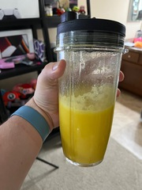

# QT-fruity
## It's a widget toolkit *and* a beverage
#### **Contributor**: *peace-blaster*

## Ingredients:
- **2** "Cuties"
- **100mL** frozen mangoes
- **2 tbps** cane sugar
- **2 tbps** plain yogurt
- **2** ice cubes

## Instructions:
- peel Cuties, add to mix
- place all ingredients in blender
- blend
- enjoy

#### [home](../README.md)