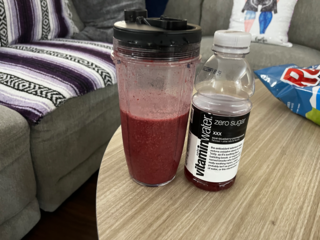

# vitaminwater_xxx_medley
## a lazy smoothie
#### **Contributor**: *peace-blaster*

## Ingredients:
- **400mL** Vitamin Water Zero XXX
- **400mL** frozen Blackberries, blueberries, strawberries, raspberries (can be bought in multipack)
- **1 tbsp** cane sugar
- **2 tbps** plain yogurt

## Instructions:
- thraw ingredients a little for better blending
- put ingredients in blender
- blend
- enjoy

#### [home](../README.md)